# Programación Concurrente

Cátedra Ing. Deymonaz, Pablo

## Trabajo Práctico 2 : ConcuRide

### Grupo Busy-Working

- Cominotti Claudia 104891
- Gismondi Máximo 110119
- Szejnfeld Sirkis Tomás 107710

### Fecha de entrega

[](https://classroom.github.com/a/GAOi0Fq-)

## Consideraciones

Pensamos realizar este trabajo utilizando el modelo de actores. Creemos que lo mejor es modelar 3 actores diferentes y un lider:

- **Actor Chofer-Lider**: Los choferes van a presentar un lider, quien es el que se encargará de redirigir las solicitudes de viajes. El lider recibirá una solicitud de viaje de un pasajero, por medio de un chofer, con quien se comunicó en primera instancia el pasajero. El pasajero previamente generó el pago del total del recorrido, la que es estandarizada por el largo del recorrido (|x_d-x_o| + |y_d - y_o|). Cuando el viaje se encuentra pagado, corroborado por el gateway de pago, chequea que el monto pagado sea el correcto. Posteriormente comienza la busqueda de choferes disponibles, por radio mas cercano al punto de inicio del viaje. Cuando encuentra un chofer que acepte el viaje, este se pondra en contacto con el pasajero para coordinarlo. El líder puede actuar a su vez como un chofer común. Cada chofer le comunica al lider su ubicación cada vez que esta es modificada, asi como su estado (en viaje, disponible, no disponible). Si no se encontro choferes disponibles para el viaje, el chofer-lider le informa al gateway de pago que devuelva el monto total del viaje al pasajero y se le informa al pasajero que el viaje es cancelado.
Si el pasajero no libera el pago luego de finalizado el viaje, el chofer lider podrá comunicarse con el gateway de pago para que este le redigira el pago al chofer que efectuó el viaje.

- **Actor Chofer**: El chofer recibe una solicitud de viaje por medio de un pasajero. Este se comunica con el chofer lider para que posteriormente se encargue de coordinar el viaje. De no recibir contestación por parte del lider, iniciará el proceso de elección de lider. Por otro lado, el chofer asignado para el viaje, se comunica con el pasajero para informarle que el viaje fue aceptado. A su vez le informa al pasajero que esta en el punto de inicio del viaje, para comenzar el mismo. Cuando el pasajero sube al vehiculo, inicia el recorrido. El chofer le indica al pasajero que llegaron a destino, para poder recibir el pago desde el gateway de pago. Le avisa al pasajero que recibio el pago. Actualiza su posicion y estado, informandole al lider.

- **Actor Pasajero**: El pasajero interactúa con el *Gateway* de pago para realizar el pago ya estandarizado y previamente explicado, según la distancia a recorrer. Cuando el pago es aceptado, le envia a un chofer de la lista que se encuentra esperando para solicitar un viaje y se queda a la espera de un conductor. Él es notificado por el chofer asignado tras la confirmación del viaje, quien a su vez debe indicarle que está listo para iniciar el viaje cuando arribe a su ubicación. Cuando el pasajero se sube al vehiculo, le informa al chofer que ya puede inciiar el viaje. El pasajero es informado al llegar a destino, y le solicita al gateway de pago que abone el total del viaje al chofer, quien corrobora el pago, dando por concluido el viaje.
Si no se encuentra chofer disponible, el chofer-lider informa que el viaje es cancelado y se le devuelve el dinero.

- **Actor Gateway de pago**: Recibe el pedido de pago desde el pasajero. Cuando recibe la petición del actor pasajero, hace la comprobación de la tarjeta y efectúa el pago, devolviendo el resultado de la transacción al cliente. Si el pago fue rechazado el pasajero tendra que intentar nuevamente. El gateway le envia al pasajero un comprobante de pago correcto. Cuando el pasajero llegue a su destino, deberá notificar al gateway para que este le libere el pago al chofer. Si el viaje se debe cancelar por falta de choferes disponibles, el chofer-lider le informa al gateway de pago que se le haga la devolución del monto al pasajero. Si el pasajero no habilitó el pago al chofer una vez llegado a destino, el chofer lider lo hará, para que el gateway transfiera el dinero al chofer.

### Búsqueda de conductor

- Posteriormente al pago, el chofer-lider busca choferes que se encuentren a 5 unidades a la redonda del lugar de solicitud del viaje. Si no encuentra ninguno, aumenta a 10 unidades a la redonda. Si no encuentra choferes activos, descarta el viaje y se devuelve el dinero al pasajero.
- El chofer lider le pregunta primero a los choferes del área que se encuentran sin viaje activo al momento. Si ninguno de ellos acepta el viaje, se les pregunta a los choferes que están por llegar a este destino, es decir, a aquellos choferes que tienen un viaje activo y que finaliza en el área de interés.

### Elección de lider

- El proceso de eleccion de lider será llevado a cabo por los choferes.
- El algoritmo utilizado será el de Bully.
- Los mismos al detectar la ausencia de un lider enviarán un mensaje ELECTION a todos los choferes con id mayor al suyo.
- De la misma forma al recibir un mensaje ELECTION, si el chofer tiene un id mayor al del chofer que envió el mensaje, este responde con un mensaje OK y seguirá propagando el mensaje ELECTION.
- El chofer que propague el mensaje y no tenga una respuesta OK, ya sea porque no hay más choferes con id mayor o porque no tuvo respuesta de aquellos con id mayor, se autoproclamará lider y enviará un mensaje COORDINATOR a todos los choferes de la red.

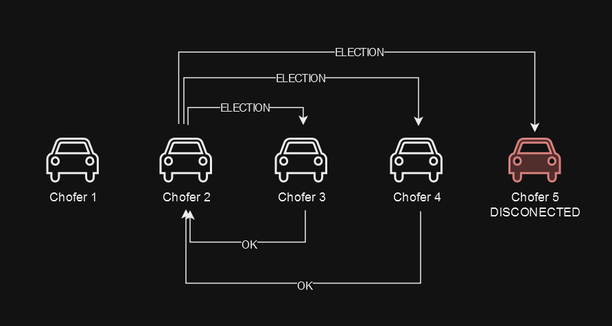

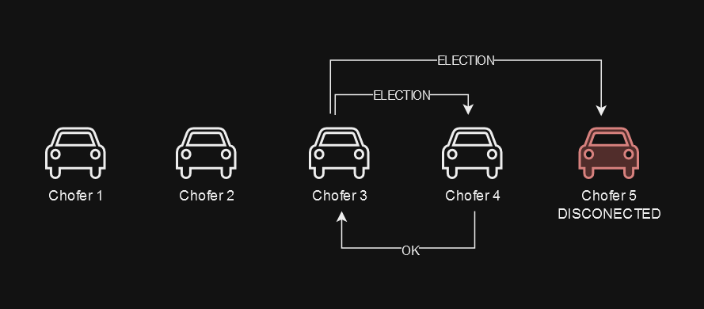

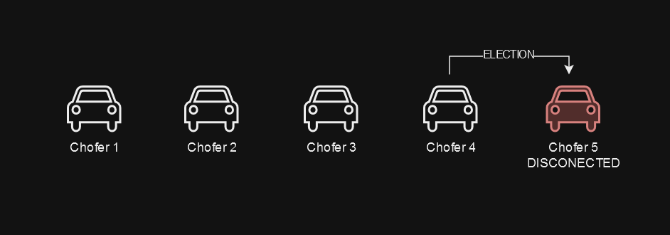

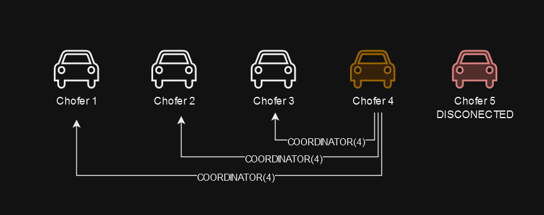

### Pago y desconexiones

- Si se completa el viaje, el pasajero le informa al gateway de pago que se le abone al conductor. Si el pasajero se desconectó antes de llegar a destino, el pago va a ser redireccionado de todos modos al conductor luego de chequear que el pasajero se desconectó.
- Si el pasajero se desconecta posterior al pago efectivo y antes de haber iniciado el viaje, el dinero queda en el *Gateway* de pago y no se redirecciona.
- Si el chofer se desconecta durante el viaje, no se puede asegurar el arribo del pasajero a destino, se le efectúa la correspondiente devolución al pasajero, previamente corroborando que el chofer se desconectó.
- Si se rechaza el viaje por falta de choferes en el área, se le devuelve el dinero al pasajero.
- Si el pasajero no habilita el pago al chofer luego de llegar a destino, el chofer le informará esta situacion al lider, quien luego de corrobrar la coordenada del chofer, le redirigirá el pago al chofer.
- Descentralización del gateway de pago:
  - Se decidió que para evitar problemas de conección con el gateway de pago, el mismo estará replicado y distribuido en varios nodos.
  - La cantidad de gateways que utilizaremos se definirá en función del tamaño de la red y la cantidad de transacciones que se realicen.
  - Los pasajeros y choferes podrán comunicarse con cualquier gateway de pago, y no necesariamente siempre con el mismo. Si intenta comunicarse con un gateway y este no responde, intentará conectarse con otro y asi hasta obtener respuesta.
  - Todos los gateways modificarán los pagos de los viajes en curso, los que estarán protegidos bajo un RWlock distribuido entre todos los gateways de la red. Esto garantiza la consistencia y la integridad de los datos.

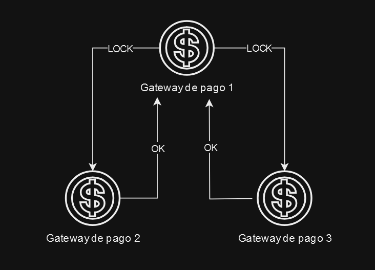

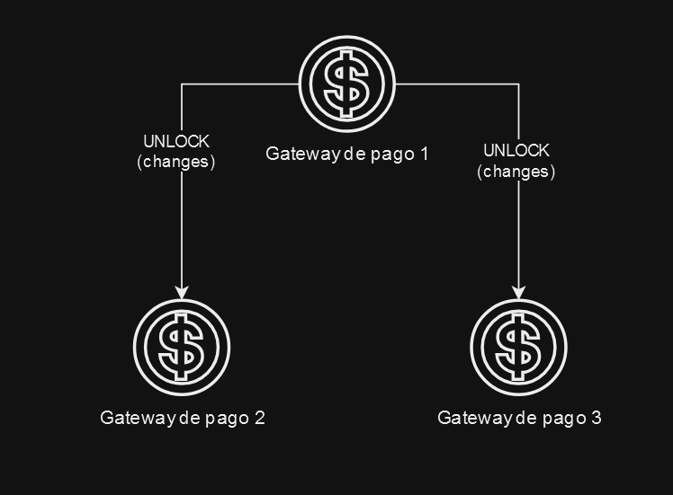

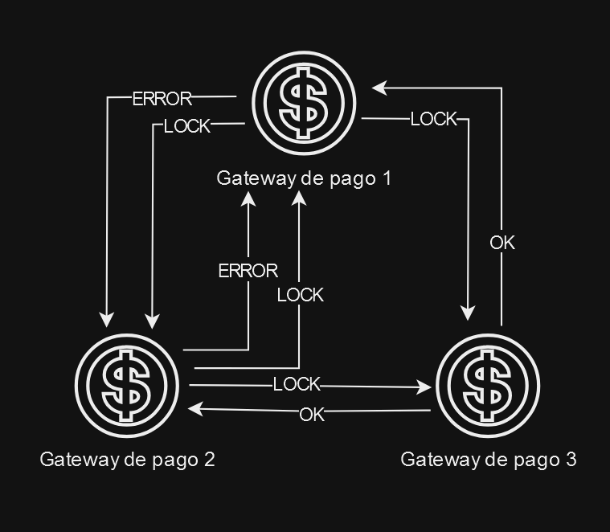

## Descripción de entidades involucradas

### Chofer lider

#### Finalidad general

- Encontrar choferes disponibles para realizar los viajes solicitados por los pasajeros.
- Resolver conflictos entre clientes y choferes al momento de realizar los viajes.
- En simultaneo, funciona como un chofer convencional.

#### Estado interno

```rust
struct LeaderDriver {
    id: u32,
    drivers: Vec<Driver>,
    trips: Vec<Trip>,
}
```

#### Mensajes que recibe

- Desde el Chofer:
  - Asignar viaje:
    - Se le indicará al chofer lider que hay un viaje nuevo a coordinar, indicando el id del pasajero.
  - Actualización de posición:
    - Posicion actualizada de un chofer.
  - Fin de viaje:
    - Envia que finalizo el viaje avisando el estado actualizado, que cambia de "en viaje" a "disponible"
- Desde el pasajero:
  - Solicitud de viaje:
    - El pasajero indica su id, su posición inicial, la posición de destino del viaje y el comprobante de pago.
- Desde el gateway de pago:
  - Estado de pago del pasajero y monto.

#### Mensajes que envía

- Al Chofer:
  - Solicitud de viaje:
    - Se le indica inicio y fin de recorrido, asi como el id del pasajero.
- Al pasajero:
  - Cancelacion de viaje, si no se encuentra chofer disponible en la zona.
  - Monto pagado incorrecto
    - Se cancela el viaje y se le devuelve el monto pagado al pasajero.
- Al gateway de pago:
  - Devolución de pago al pasajero.
    - Tras no encontrar choferes disponibles para realizar el viaje.
  - Solicitar información de pago:
    - Consulta si el pago fue realizado correctamente.
  - Asignar al acredor:
    - Asignar al chofer que recibirá el pago.

#### Protolos de transporte y de aplicación utilizados

Utilizaremos el protocolo de transporte TCP ya que es mas fiable para la transmision de paquetes y el manejo de perdida de los mismos.
Usaremos el formato JSON para el contenido de estos mensajes.

#### Casos de interés

- Caso espedado: Encuentra conductor disponible, se conecta con el pasajero.
- Caso inesperado:
  - No encuentra conductor.
  - Informa al gateway para devolver el pago.
  - Encuentra conductor pero el pasajero no contesta más (se desconecto)

### Chofer

#### Finalidad general

- Transportar al pasajero asignado al destino
- Recibir el pago por el servicio

#### Estado interno

```rust
struct Driver {
    id: u32,
    position: Coordinate,
    state: DriverState,
}

enum DriverState {
    InTravel(Trip),
    Available,
    NotAvailable,
}
```

#### Mensajes que recibe

- Desde el lider:
  - Solicitud de viaje:
    - Se le indica inicio y fin de recorrido, asi como el id del pasajero.
    - El chofer decide aleatoriamente si acepta el viaje o no.
- Desde el pasajero:
  - Solicitud de viaje:
    - El pasajero indica su id, su posición inicial, la posición de destino del viaje y el comprobante de pago.
    - La información del viaje es enviada al chofer lider.
  - Inicio de viaje:
    - El pasajero le avisa al chofer que ya se encuentra dentro del auto para iniciar el viaje.
  - Pago habilitado:
    - El pasajero le avisa al chofer que libero el pago para que este pueda cobrarlo.
    - El chofer hace la verificación del pago.
- Desde el gateway de pago:
  - Pago de viaje
    - Respuesta del gateway de pago a mensaje enviado desde el chofer.

#### Mensajes que envía

- Al lider:
  - Asignar viaje:
    - Se le indicará al chofer lider que hay un viaje nuevo a coordinar, indicando el id del pasajero.
  - Actualizacion de estado:
    - Avisa la posición actualizada.
    - Avisa el estado actualizado.
  - Fin de viaje:
    - Informa la finalización del viaje.
- Al pasajero:
  - Viaje aceptado: Le informa al pasajero que el viaje fue aceptado y que pronto pasará a recogerlo.
  - Inicio de viaje: para que se suba el pasajero al vehiculo.
  - Fin de viaje:
    - Para que el pasajero habilite el pago.
  - Pago recibido:
    - Le informa al pasajero que recibió el pago, para que este pueda finalizar el viaje y descender del vehiculo.
- Al Gateway de pago:
  - Cobrar viaje:
    - Para recibir el pago por el transporte realizado.

#### Protolos de transporte y de aplicación utilizados

Utilizaremos el protocolo de transporte TCP ya que es mas fiable para la transmision de paquetes y el manejo de perdida de los mismos.
Usaremos el formato JSON para el contenido de estos mensajes.

#### Casos de interés

- Caso esperado:
  - El conductor acepta el viaje, transporta al pasajero, y finaliza el trayecto.
  - Al llegar a destino, el pago es efectuado y el chofer recibe el monto pactado por el viaje.
- Caso inesperado:
  - El conductor se desconecta antes de iniciar el viaje y el lider reasigna el viaje de ser posible.
  - El chofer no recibe el pago por el viaje: En este caso se le informa al chofer lider, quien habilitara el pago desde el gateway de pago siempre y cuando el chofer se encuentra en las coordenadas de destino.
  - El pasajero reclama una desconexión del chofer: Si el chofer asiganado se desconecta antes de llegar a destino, el lider le informa al gateway de pago que se devuelva el monto total al pasajero.

### Pasajero

#### Finalidad general

- Solicitar viajes.
- Interactuar con el gateway de pagos para realizar y habilitar el pago.
- Interactua con el chofer para iniciar y finalizar el viaje.

#### Estado interno

```rust
struct Passenger {
    id: u32,
    position: Coordinate,
    destiny: Coordinate,
    card_number: [u8; 16],
}
```

#### Mensajes que recibe

- Desde el chofer lider:
  - Cancelacion de viaje: cuando el pago es rechazado o cuando no hay choferes disponibles.
- Desde el chofer:
  - Viaje aceptado:
    - Se le informa que el viaje fue aceptado y está pronto a llegar a origen.
  - Inicio de viaje:
    - Se indica que inicia el viaje.
    - El pasajero debe subirse al vehiculo.
  - Fin de viaje:
    - Se indica que finaliza el viaje y debe bajarse del vehiculo.
- Desde gateway de pago:
  - Estado del pago:
    - Puede ser aceptado o rechazado.
  - Retorno de pago:
    - En caso de que el viaje no pueda realizarse y este sea cancelado.

#### Mensajes que envía

- Al chofer:
  - Solicitud de viaje:
    - A un chofer de la lista de choferes
    - Si no hay respuesta, intentará con otro chofer hasta obtener respuesta o barra todas las posibilidades.
  - Inicio de viaje:
    - Ya se subió al vehículo y está listo para iniciar el viaje.
  - Pago habilitado:
    - Le indica al chofer que ya puede cobrar el viaje.

- Al Gateway
  - Envio de tarjeta:
    - Envia los datos de la tarjeta y el monto para verificar si se aprueba o no el pago y Reguardar el monto a pagar.
  - Habilitar pago:
    - Le indica al gateway que habilite el pago para el chofer.

#### Protolos de transporte y de aplicación utilizados

#### Casos de interés

- Caso esperado: El pasajero solicita el viaje, paga, se conecta con el conductor, y llega a su destino.
- Caso inesperado:
  - El pasajero se desconecta después del pago, antes de iniciar el viaje; el pago queda en el gateway sin redireccionar.
  - No hay conductores habilitados para realizar el viaje.
  - No hay conductores que respondan a la solicitud del viaje.

### Gateway

#### Finalidad general

- Manejar los pagos de los viajes
- Verificar la validez de la tarjeta

#### Estado interno

```rust
struct Gateway {
    payments: HashMap<u32, Payment>, // id del pago y el pago asociado
}

struct Payment {
    payer: u32,         // id del pasajero
    payee: Option<u32>, // id del chofer
    amount: u32,
    status: PaymentStatus,
}

enum PaymentStatus {
    Pending,
    Accepted,
    Rejected,
    Paid,
    Refunded,
}
```

#### Mensajes que recibe

- Desde el chofer lider:
  - Solicitar información de pago:
    - Se le solicita información del pago para verificar si el monto es correcto y si el pago fue aprobado.
  - Devolver el pago:
    - En caso de que no haya choferes disponibles para realizar el viaje.
    - Devolver el monto al pasajero.
  - Asignar al acredor:
    - Asignar al chofer que recibirá el pago.
- Desde el pasajero:
  - Pago:
    - Recibe el monto y los datos de la tarjeta del pasajero.
    - Intento de pago del pasajero.
  - Habilitar pago:
    - Habilita el pago para el chofer.

#### Mensajes que envía

- Al pasajero:
  - Resultado de pago:
    - Aceptado o rechazado.
  - Reembolso:
    - En caso de que el viaje no se pueda realizar.
- Al chofer:
  - Pago:
    - Se le abona el monto del viaje.
- Al lider:
  - Información de pago:
    - Se le informa el monto y el estado del pago.

- ResultadoPagoRechazado al pasajero.
- ResultadoPagoACeptado al pasajero y al chofer lider
- Pagar: puede ser al pasajero en caso de no efectuarse el pago si no hay chofer disponible o al chofer cuando se realizó el viaje.

#### Protolos de transporte y de aplicación utilizados

Utilizaremos el protocolo de transporte TCP ya que es mas fiable para la transmision de paquetes y el manejo de perdida de los mismos.
Usaremos el formato JSON para el contenido de estos mensajes.

#### Casos de interés

- Caso espedado: Pago autorizado y finalizado.
- Caso inesperado: Rechazo aleatorio de la tarjeta o desconexión.

### Common Structs

```rust
struct Trip {
    passenger: u32,
    designated_driver: Option<u32>,
    origin: Coordinate,
    destiny: Coordinate,
    payment: u32,   // id del pago
    status: TripStatus,
}

enum TripStatus {
    Searching,  // Buscando chofer
    Waiting,    // Esperando que el chofer busque al pasajero
    InProgress, // Viaje en curso
    Finished,   // Viaje finalizado con exito
    Canceled,   // El viaje se canceló y el pasajero recibió el reembolso
}

struct Coordinate {
    x: i32,
    y: i32,
}
```

## Flujo de mensajes convencional

El flujo de mensajes convencional es el siguiente:

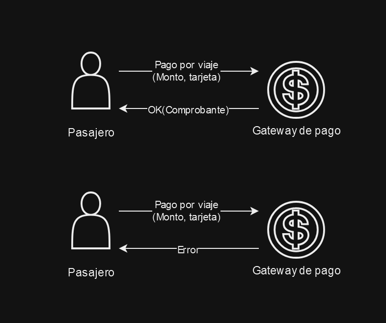

Si el pago es aceptado:

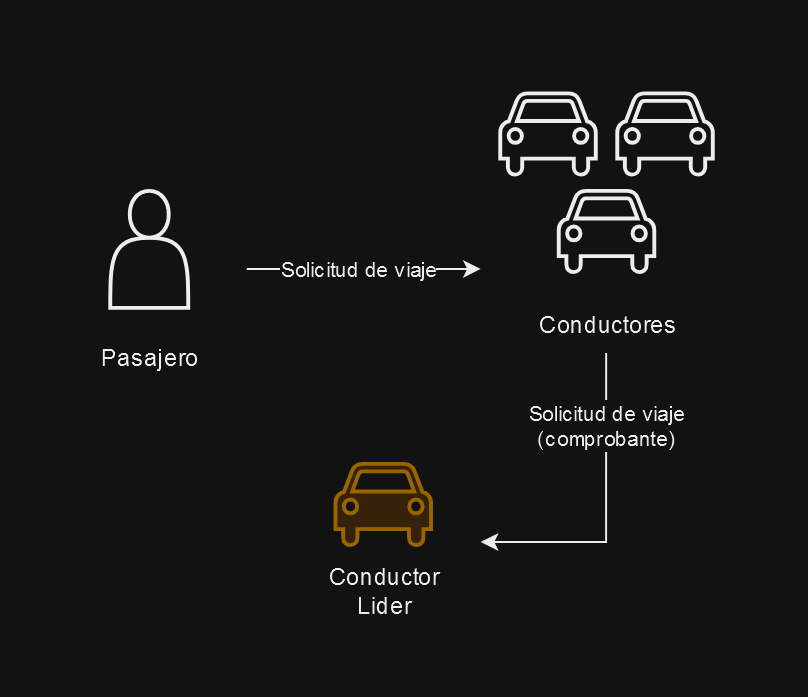

Si no hay choferes disponibles:

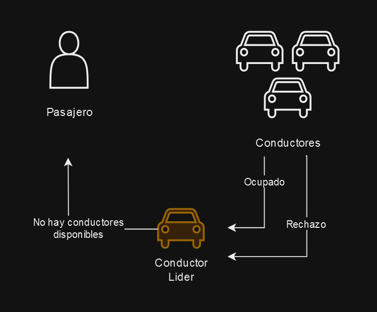

Si hay choferes disponibles:

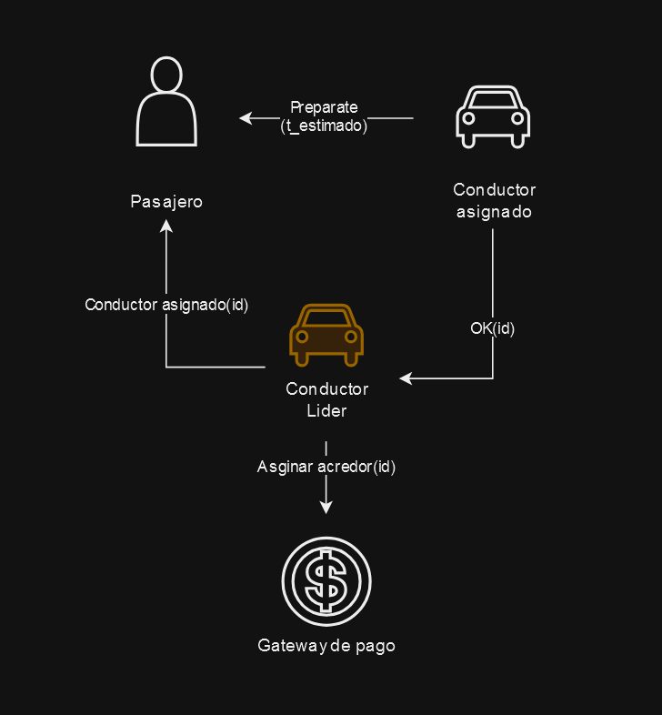

Cuando el chofer llega al origen del viaje:

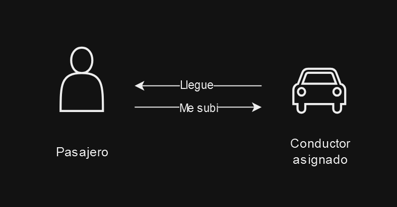

Cuando el chofer llega al destino del viaje:

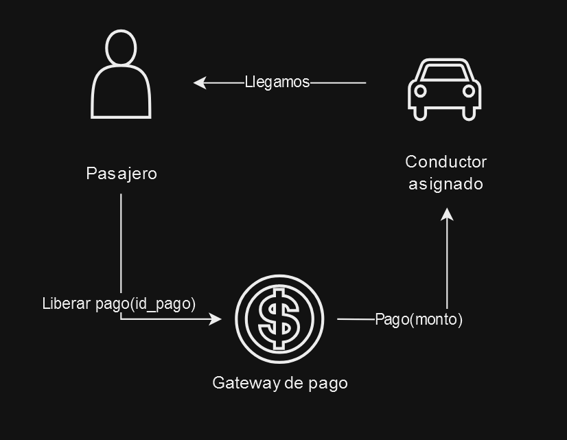

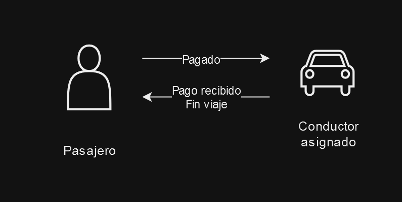

## Cambios realizado desde la primera entrega

- **Actor Chofer**: Se le ofrecera el viaje a los choferes disponibles más cercanos del punto de inicio del viaje, con una distancia maxima de 10 unidades. El chofer a quien le ofrezcan el viaje podra aceptar el mismo con una probablidad del 85%.
El chofer, en casos de desconexion del pasajero, recibirá el pago del viaje ya sea si llego a destino o si busco al pasajero y este nunca se presentó para iniciar el viaje, siempre luego de un tiempo razonable de espera de 4 segundos.

- **Actor Gateway**: Tendremos una unica instancia del gateway, por lo que si este no funciona por algún motivo, el pasajero que requiera solicitar un viaje no podrá realizarlo hasta que el Gateway se reconecte.

- **Actor Chifer Lider**: El lider se obtiene por medio del algoritmo Bully entre los choferes. Cuando un chofer nuevo se conecta inicia un mensaje Election con los otros choferes, quedando como lider el chofer con ID mas alto. A su vez, los choferes no lider, le envian al lider informacion sobre su estado de forma constante, si alguno de los drivers no reciben el reconocimiento del lider, inician luego de un timeout la eleccion del lider nuevamente. Si se inicia la busqueda de lider debido a que ingreso un nuevo driver, pero hay un lider con datos activo, cuando se completa la eleccion, el lider previo le enviara por un mensaje la información guardada de los viajes activos hasta el momento y posteriormente borrara estos datos dado que deja de ser el lider.
Si el lider se desconectó la información que tenia se pierde, teniendo que ser solicitada por el nuevo lider, luego de la elección los choferes nuevamente.

### Estructuras utilizadas que cambiaron con respecto a lo planteado previamente

```rust
pub struct TcpLayer<A>
where
    A: TCPConcuRideActor,
    TCPConcuRideActorContext<A>: TCPConcuRideActorToEvelope<A>,
{
    pub id: Id,
    pub actor_type: ActorType,
    pub connections: HashMap<ActorType, HashMap<Id, Addr<TcpConnection<A>>>>,
    pub peers: Peers,
    pub actor: Option<Addr<A>>,
}

pub struct TcpConnection<A>
where
    A: ConcuRideHandler,
    ConcuRideActorContext<A>: TCPConcuRideActorToEvelope<A>,
{
    pub my_id: Id,
    pub my_actor_type: ActorType,
    pub other_id: Id,
    pub other_actor_type: ActorType,
    pub write: Option<WriteHalf<TcpStream>>,
    pub actor: Addr<A>,
    pub tcp_layer: Addr<TcpLayer<A>>,
}
```

La mayor modificación que realizamos con respecto a lo indicado en la entrega anterior es que tenemos una capa, desde la cual se realiza el pasaje de mensajes por TCP. La TCP Layer tiene la estructura indiacada, con el id de cada actor, y el tipo de actor, vinculado con un potencial TCP Connection que se establece entre dos actores. La capa TCP se encarga de manejar las conexiones entre los actores y de enviar los mensajes entre ellos.

```rust
pub struct Ride {
    pub passenger_id: Id,
    pub from: Coordinate,
    pub to: Coordinate,
    pub status: RideStatus,
    pub driver: Option<Id>,
}

pub enum RideStatus {
    Requested,
    LookingForDriver,
    GoingToPickup,
    WaitingToStart,
    InProgress,
    Completed,
}
```

La estructura viaje la renombramos como Ride, a su vez decidimos que no tenga el payment, ya que este es fijo por la distancia que recorre, y el estado del viaje, ya que este es parte del Driver.
Con respecto al estado del viaje, también le realizamos algunas modificaciones, por un lado agregamos el estado Requested, ya que desde que el pasajero solicita el viaje hasta que un chofer lo acepta pasa un tiempo y requeriamos este estado que previamente no lo tomamos en cuenta. LookingForDriver es el que previamente llamamos Searching. GoingToPickup, es cuando el chofer acepto el viaje y esta en camino a pasar a buscar al pasajero a origen. WaitingToStart, tampoco se encontraba en el enumerativo original, esto es cuando el chofer llega al origen del viaje y espera a que el pasajero suba. Sacamos el estado Canceled ya que decidimos que este caso no suceda, si el pasajero quiere suspender el viaje, se puede desconectar y en ese caso el pago se efectuará al chofer.

``` rust
pub enum PaymentStatus {
    Pending,
    Accepted,
    Rejected,
    Paid,
    Refunded,
    RefundedWithoutRebooking, 
}

pub(crate) struct Gateway {
    pub payments: HashMap<Id, Payment>,
    pub tcp_layer: Addr<TcpLayer<Gateway>>,
    pub gateway_accept_rate: f64,
}
```

En este tipo enumerativo agregamos el estado RefundedWithoutRebooking. A su vez el Gateway tambien tiene que tener la capa tcp para la comunicación con otros actores.

``` rust
pub struct Driver {
    id: Id,
    position: Coordinate,
    leader: Option<Id>,
    leader_data: Option<Leader>,
    peers: Peers,
    tcp_layer: Addr<TcpLayer<Driver>>,
    election_in_progress: bool,
    election_acks: usize,
    info_acks: bool,
    driver_status: DriverStatus,
    queued_messages: VecDeque<String>,
    driver_accept_rate: f64,
}

pub struct DriverState {
    pub id: Id,
    pub position: Coordinate,
    pub status: DriverStatus,
}

pub enum DriverStatus {
    Free,
    AcceptingRide(Ride),
    Busy(Ride),
}
```

Realizamos esta estructura con el estado de los choferes, que consta no solo de su estado (libre, aceptando viaje y ocupado), sino tambien de su posición, ya que ambos son necesarios para que el lider pueda ofrecer o no el viaje al chofer según su cercania al lugar de pedido del viaje y a su estado. Además agregamos múltiples campos en el driver, para manejar los datos del lider, si se encuentra en proceso de elección, la cantidad de acks que recibió, si recibió la información del lider, y la tasa de aceptación de viajes.

``` rust
pub struct Leader {
    pub active_rides: HashMap<Id, Ride>,
    pub drivers_states: HashMap<Id, (Coordinate, DriverStatus)>,
    pub asked_drivers: HashMap<Id, HashMap<Id, Response>>,
}
```

El lider mantiene una serie de estructuras para seguir el estado de los viajes y choferes.

``` rust

pub struct Passenger {
    id: Id,
    position: Coordinate,
    destination: Coordinate,
    peers: Peers,
    tcp_layer: Addr<TcpLayer<Passenger>>,
    driver_assigned: Option<Id>,
    passenger_status: PassengerStatus,
    asked_drivers: HashSet<Id>,
}

```

En este caso, decidimos que no es necesario que el pasajero tenga la tarjeta como parte de la estructura. Si requiere los choferes a los que le preguntó en un principio para solicitar el viaje y el Id del chofer asignado al viaje.

## Documentación

Para leer la documentación del código fuente, debemos situarnos en el `workspace` y ejecutar el siguiente comando:

```bash
cargo doc --open
```

## Como ejecutar el programa

Si se desea correr cada componente por separado debemos estar en la carpeta `workspace` y ejecutar los siguientes comandos:

### Conductores

```bash
cargo run --release --bin driver <driver_id> <path/to/config.json>
```

Si se desean correr varios conductores, se puede hacer de la siguiente manera:

```bash
chmod +x scripts/run_drivers.sh
./scripts/run_drivers.sh [--driver <amount_of_drivers> --config <path/to/config.json>] [--log]
```

Si se desean guardar los logs de los conductores en vez de mostrarlos por pantalla, se debe agregar el flag `--log`.
Los mismos se guardaran en la carpeta `logs` con el nombre `driver_<driver_id>.log`.

### Pasajeros

```bash
cargo run --release --bin passenger <passenger_id> <path/to/config.json>
```

Si se desean correr varios pasajeros, se puede hacer de la siguiente manera:

```bash
chmod +x scripts/run_passengers.sh
./scripts/run_passengers.sh [--passenger <amount_of_passengers> --config <path/to/config.json>] [--log]
```

Si se desean guardar los logs de los pasajeros en vez de mostrarlos por pantalla, se debe agregar el flag `--log`.
Los mismos se guardaran en la carpeta `logs` con el nombre `passenger_<passenger_id>.log`.

### Gateway de pagos

Tan solo se necesita una instancia del gateway de pagos.

```bash
cargo run --release --bin gateway <gateway_id> <path/to/config.json>
```

Aún así se puede correr la instancia de gateway de pagos de la siguiente manera:

```bash
chmod +x scripts/run_gateway.sh
./scripts/run_gateway.sh [--id <gateway_id> --config <path/to/config.json>] [--log]
```

Si se desean guardar los logs del gateway en vez de mostrarlos por pantalla, se debe agregar el flag `--log`.
Los mismos se guardaran en la carpeta `logs` con el nombre `gateway.log`.

## Archivos de configuración

El archivo de configuración debe ser un archivo JSON con la siguiente estructura:

```json
{
  "drivers":[
    {
      "id": <driver_id>,
      "address": "<driver_ip>:<driver_port>",
      "position": {
        "x": <x_start_position>,
        "y": <y_start_position>
      }
    },
    ...
  ],
  "passengers":[
    {
      "id": <passenger_id>,
      "address": "<passenger_ip>:<passenger_port>",
      "origin": {
        "x": <x_start_position>,
        "y": <y_start_position>,
      },
      "destination": {
        "x": <x_destination_position>,
        "y": <y_destination_position>
      }
    },
    ...
  ],
  "gateways": [
    "id": <gateway_id>,
    "address": "<gateway_ip>:<gateway_port>"
  ],
  "gateway_accept_rate": <gateway_accept_rate>,
  "driver_accept_rate": <driver_accept_rate>,
}
```

Hay algunos archivos de configuración de ejemplo en la carpeta `config`.
